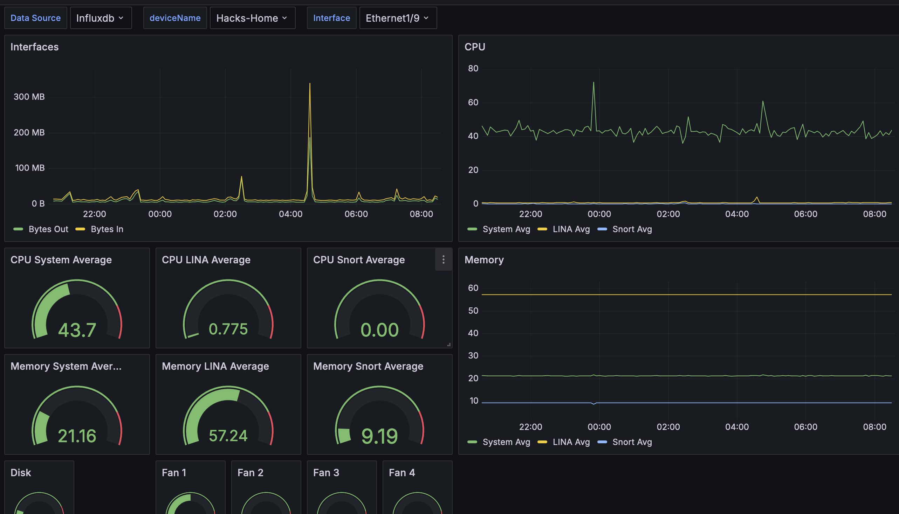

# Telegraf Config for Cisco Security Cloud Control

## Abstract
This is a demonstration of how to get Cisco Firewall Threat Defense appliance metrics from the SaaS firewall manager Cisco Security Cloud Control (Formerly known as Cisco Defense Orchestrator or CDO) API and then store the metrics in InfluxDB. The API endpoint that this configuration hits is documented [here](https://developer.cisco.com/docs/cisco-defense-orchestrator/get-health-metrics-on-devices-managed-by-the-fmc-cdfmc-only/). Of course once the data is in InfluxDB it's easy to build visualizations for the data in Grafana.

## TLDR;
- `git clone https://github.com/aaronhackney/scc_telegraf.git`
- `cd scc_telegraf`
- Edit .env file
- `docker-compose --env-file .env up -d`

## Requirements

### Telegraf
Telegraf 1.15+

### InfluxDB
Create a bucket in Influx DB for this telemetery and set the `INFLUX_BUCKET` environment variable to the same value (See below)

### Starlark plugin
The telegraf starlark plugin is required. This is included with Telegraf 1.15+

## Config Files
### Environment variables
See the SCC API documenation [here](https://developer.cisco.com/docs/cisco-defense-orchestrator/getting-started/#base-uri) for the base url for your tenant's region. See the sample .env file.
```
BASE_DIR=/home/user/scc_telegraf
SCC_BASE_URL=<SCC base URL>
SCC_TOKEN=<SCC API token>
INFLUX_BUCKET=<InfluxDB bucket>
INFLUX_TOKEN=<InfluxDB API Token>
INFLUXDB_URL=<InfluxDB URL>
INFLUX_ORG_NAME=<InfluxDB org name>
FMC_UID=<UID of the cdFMC>
UID=${UID}
GID=${GID}
```

Note that you can get your cdFMC UID from the cdFMC API Explorer under `System` `/api/fmc_platform/v1/info/domain`.


### etc/telegraf.d/telegraf_cdo.conf
There is nothing that needs edited in this file other than the poll interval which at most and by default is set to every 5 minutes (API Throttled).

### starlark/multi-metric_json.star
There is nothing that needs edited in this file. It simply formats the data in a time-series database friendly way.

## Start the docker container
`docker-compose --env-file .env up -d`

## Troubleshooting, Tips, and Tricks
- Run `docker-compose --env-file .env up` (without the -d) to see the log output in real time
- Verify your env variables are correct in the shell. e.g. `echo $SCC_TOKEN`
- View the log files (daemon mode) `docker logs telegraf`
- In this compose file we are using sensitive variables like API keys from a clear text file for demonstration simplicity. It's recommended to follow best practices to use a password safe or [docker secrets](https://docs.docker.com/compose/how-tos/use-secrets/).
- Add `debug=true` to an `[agent]` stanza at the top of `telegraf_cdo.conf` to increase logging verbosity
    ```
    [agent]
      debug = true
    ```
## Grafana Dashboad
The `ftd_dashboard.json` file can be imported into Grafana.
- In Grafana, create a new data source pointing to your InfluxDB database
- This datasource should point to the bucket where telegraf has been storing data
- Load the dashboard and select the datasource that you just configured from the dropdown

