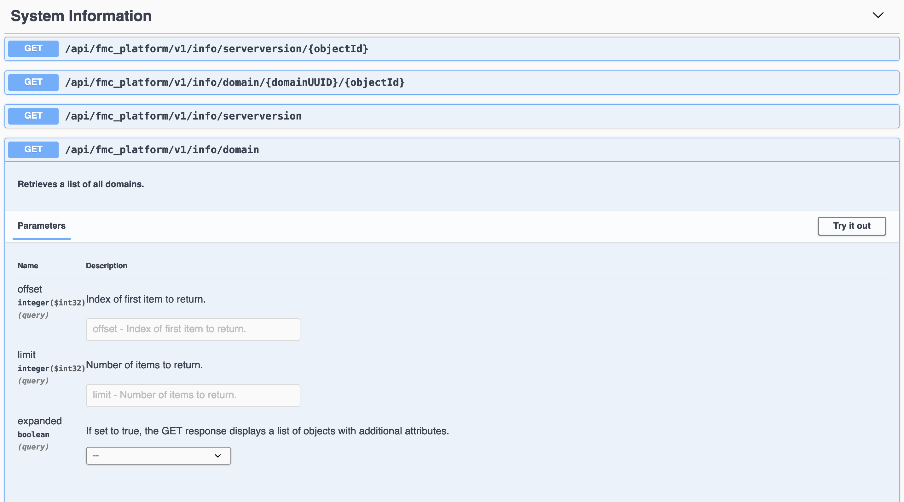

# Telegraf Config for Cisco Defense Orchestrator

## Abstract
This is a demonstration of how to get Cisco Firewall Threat Defense appliance metrics from the SaaS firewall manager Cisco Secure Cloud Control (Formerly known as Cisco Defense Orchestrator or CDO) API and then store the metrics in InfluxDB. The API endpoint that this configuration hits is documented [here](https://developer.cisco.com/docs/cisco-defense-orchestrator/get-health-metrics-on-devices-managed-by-the-fmc-cdfmc-only/). Of course once the data is in InfluxDB it's easy to build visualizations for the data in Grafana.

## TLDR;
- Edit env.sh file
- source env.sh
- docker-compose up -d

## Requirements

### Telegraf
Telegraf 1.15+

### InfluxDB
Create a bucket in Influx DB for this telemetery and set the `INFLUX_BUCKET` environment variable to the same value (See below)

### Starlark plugin
The telegraf starlark plugin is required. This is included with Telegraf 1.15+

## Config Files
### Environment variables
See the SCC API documenation [here](https://developer.cisco.com/docs/cisco-defense-orchestrator/getting-started/#base-uri) for the base url for your tenant's region. See the sample env.sh file.
```
export BASE_DIR=/home/user/scc_telegraf
export SCC_BASE_URL=<SCC base URL>
export SCC_TOKEN=<SCC API token>
export INFLUX_BUCKET=<InfluxDB bucket>
export INFLUX_TOKEN=<InfluxDB API Token>
export INFLUXDB_URL=<InfluxDB URL>
export INFLUX_ORG_NAME=<InfluxDB org name>
export FMC_UID=<UID of the cdFMC>
```
Then make the environment variable available to the shell with `source env.sh`

Note that you can get your cdFMC UID from the cdFMC API Explorer under `System` `/api/fmc_platform/v1/info/domain`.


### etc/telegraf.d/telegraf_cdo.conf
There is nothing that needs edited in this file other than the poll interval which at most and by default is set to every 5 minutes (API Throttled).

### starlark/multi-metric_json.star
There is nothing that needs edited in this file. It simply formats the data in a time-series database friendly way.

## Start the docker container
`docker-compose up -d`

## Troubleshooting
- Run `docker-compose up` (without the -d) to see the log output in real time
- Verify your env variables are correct in the shell. e.g. `echo $SCC_TOKEN`
- Add `debug=true` to an `[agent]` stanza at the top of `telegraf_cdo.conf`
    ```
    [agent]
      debug = true
    ```
